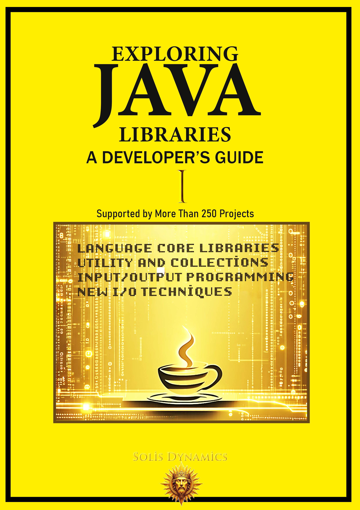

# Exploring Java Libraries – Free Code Examples & Companion Resources

Selected Java code examples and companion resources for **Exploring Java Libraries: A Developer’s Guide** by **Solis Dynamics**.

This repository contains curated examples and supporting materials designed to help developers learn Java through real-world implementation, not just theory.

## What this repository includes

- Core Java library examples
- Concurrency and multithreading samples
- File I/O and filesystem code
- Reflection and runtime inspection examples
- Practical, developer-focused Java patterns

## What this repository is for

This repo is a companion resource for the full book. It is intended to:

- provide a preview of the book’s style and depth
- share selected sample code
- help readers practice core Java concepts
- support developers looking for practical Java guidance

## Full book

If you want the complete guide, you can get the full book here:

- Leanpub: https://leanpub.com/java-libraries-guide
- Gumroad: https://solisdynamics.gumroad.com/l/java-libraries-guide
- Amazon: https://www.amazon.com/dp/B0GWWXB5BV

## About the book

**Exploring Java Libraries: A Developer’s Guide** is a technical Java book focused on core libraries, real-world examples, and practical software development.

The book covers:

- `java.lang`
- `java.util`
- `java.io`
- `java.nio`
- `java.time`
- reflection
- concurrency
- structured problem solving

## Who this is for

- Intermediate Java developers
- Advanced Java learners
- Backend engineers
- Computer science students
- Developers who want practical Java knowledge

## Brand

**Solis Dynamics**  
Technical publishing for developers.

## Contact

solisdynamicscontact@gmail.com

## License

This repository is intended for educational and promotional use.
